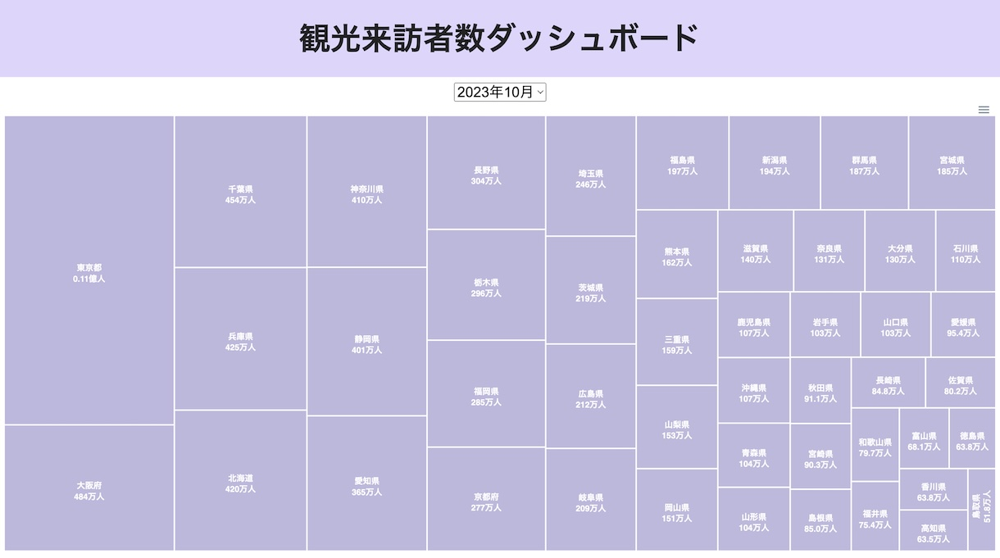

# japan-kanko-dashboard

都道府県および市区町村別の観光来訪者数を可視化するダッシュボードです。

## デモ

- **[メインダッシュボード](https://code4fukui.github.io/japan-kanko-dashboard/)**: 地域、都道府県、市区町村別の月別観光来訪者データを、ツリーマップや折れ線グラフでインタラクティブに探索できるダッシュボードです。
- **[前年比](https://code4fukui.github.io/japan-kanko-dashboard/compprev.html)**: 特定の地域の月別観光来訪者数を過去2年間と比較するツールです。

## 機能

### メインダッシュボード
- **ツリーマップによる可視化**: 全国の都道府県別、または選択した都道府県内の市区町村別の観光来訪者数の内訳を表示します。
- **トレンド分析**: 日本の主要な地域ごとにグループ化された折れ線グラフで、月別の観光来訪者数の傾向を分析します。
- **インタラクティブなフィルタリング**: 特定の年月を選択して、該当するデータを表示します。

### 前年比比較
- **詳細な比較**: 任意の都道府県または市区町村を選択して、比較用の折れ線グラフを生成します。
- **複数年表示**: グラフには今年、前年、前々年のデータが表示され、傾向を簡単に把握できます。

## データソース
- データは、公益社団法人 日本観光振興協会が提供する[デジタル観光統計オープンデータ](https://www.nihon-kankou.or.jp/home/jigyou/research/d-toukei/)から取得しています。
- 加工済みのデータは[GitHub](https://github.com/code4fukui/japan-kanko-stat)で公開されており、本ダッシュボードでは[CSVファイル](https://code4fukui.github.io/japan-kanko-stat/data/all.csv)として読み込んでいます。

## ライセンス
MIT License — 詳細は [LICENSE](LICENSE) を参照してください。
